<p align="center">
  
</p>

<p align="center">
  <strong>Nền tảng giám sát và cảnh báo môi trường đô thị thông minh</strong>
</p>

<p align="center">
  <em>"Khi dữ liệu mở trở thành cảnh báo sớm cho cộng đồng"</em>
</p>

<p align="center">
  <a href="LICENSE"></a>
  
  
</p>

<p align="center">
  
  
  
  
  
  
  
</p>

---

## 📋 Mục Lục

- [Giới thiệu](#-giới-thiệu)
- [Tính năng](#-tính-năng)
- [Screenshots](#-screenshots)
- [Kiến trúc hệ thống](#-kiến-trúc-hệ-thống)
- [Tech Stack](#-tech-stack)
- [Cài đặt nhanh](#-cài-đặt-nhanh)
- [Tài liệu](#-tài-liệu)
- [Đóng góp](#-đóng-góp)
- [Team NEU-DataVerse](#-team-neu-dataverse)
- [License](#-license)

---

## 🎯 Giới thiệu

**Smart Forecast** là nền tảng **giám sát và cảnh báo môi trường đô thị thông minh**, được phát triển hướng tới hỗ trợ **chuyển đổi số** cho các thành phố hiện đại.

Dự án tham gia cuộc thi **OLP'2025 – Ứng dụng dữ liệu mở liên kết phục vụ chuyển đổi số**, tuân thủ chuẩn **NGSI-LD** và sử dụng **Smart Data Models** của FIWARE.

### 🌟 Ý tưởng cốt lõi

Smart Forecast thu thập dữ liệu **chất lượng không khí (Air Quality)** và **thời tiết (Weather)** từ các nguồn mở như **OpenWeatherMap**, sau đó:

- Phân tích, hiển thị và **cảnh báo tự động** khi vượt ngưỡng
- Cho phép **quản lý** gửi cảnh báo thiên tai, xem báo cáo và thống kê
- Cho phép **người dân** nhận thông báo và **gửi báo cáo sự cố** (ngập lụt, cây đổ, sạt lở...) kèm vị trí GPS và ảnh

---

## ✨ Tính năng

### 📱 Ứng dụng di động (Citizen App)

| Mã  | Chức năng                  | Mô tả                                                |
| --- | -------------------------- | ---------------------------------------------------- |
| C1  | Đăng nhập / Đăng ký        | Xác thực JWT với Google OAuth2                       |
| C2  | Xem dữ liệu môi trường     | Hiển thị AQI, PM2.5, nhiệt độ, độ ẩm theo vị trí GPS |
| C3  | Bản đồ đô thị (Live Map)   | Bản đồ cảnh báo sự cố                                |
| C4  | Nhận cảnh báo tự động      | Push Notification qua Firebase Cloud Messaging       |
| C5  | Gửi báo cáo sự cố          | Chụp ảnh, chọn loại sự cố, nhập mô tả, gửi vị trí    |
| C6  | Lịch sử cảnh báo & báo cáo | Theo dõi các cảnh báo và sự cố đã gửi                |

### 🖥️ Dashboard quản trị (Admin Web)

| Mã  | Chức năng               | Mô tả                                              |
| --- | ----------------------- | -------------------------------------------------- |
| A1  | Đăng nhập quản trị      | Phân quyền Admin/Manager                           |
| A2  | Theo dõi thời gian thực | Bản đồ cảm biến, biểu đồ AQI, nhiệt độ, thời tiết  |
| A3  | Quản lý báo cáo sự cố   | Xem, xác nhận, gán trạng thái xử lý                |
| A4  | Gửi cảnh báo đô thị     | Soạn và gửi cảnh báo tự động đến người dân qua FCM |
| A5  | Xuất báo cáo            | Export thống kê PDF/CSV theo tháng, quý, năm       |

---

## 📸 Screenshots

### 🖥️ Web Dashboard

<p align="center">
  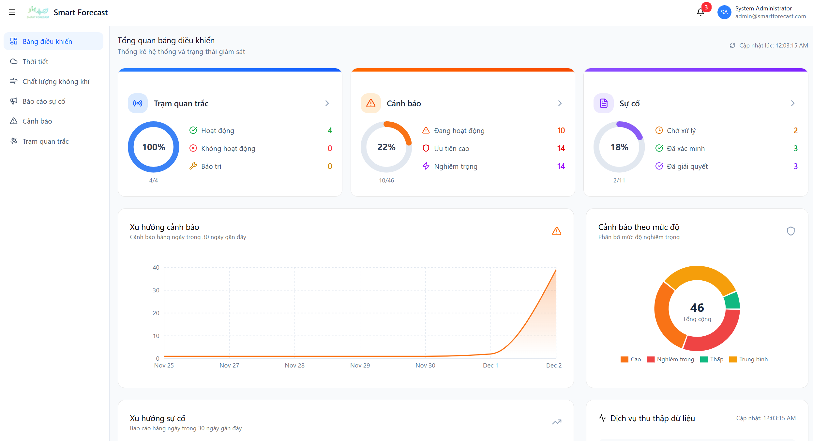
</p>
<p align="center"><em>Trang Dashboard tổng quan - Hiển thị thông tin trạm, cảnh báo, sự cố và chỉ số AQI</em></p>

<p align="center">
  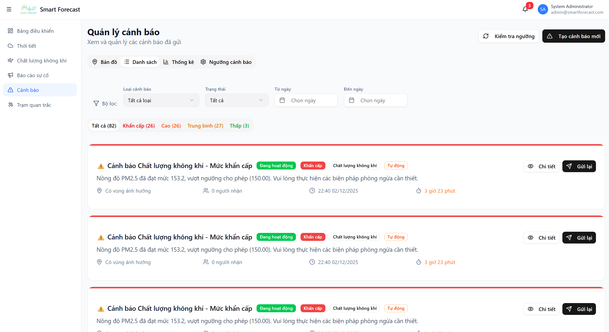
  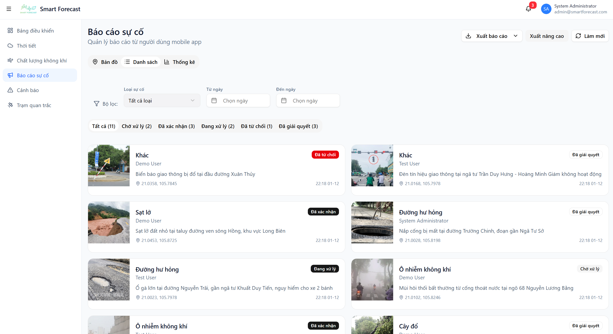
</p>
<p align="center"><em>Quản lý cảnh báo (trái) và Quản lý sự cố (phải)</em></p>

<p align="center">
  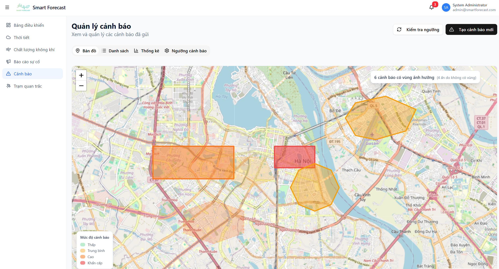
  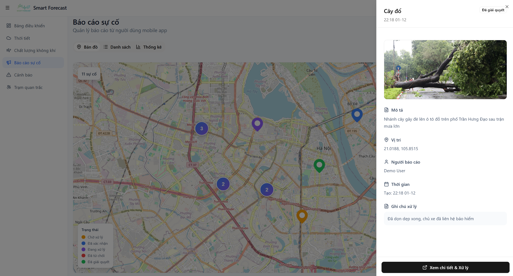
</p>
<p align="center"><em>Bản đồ cảnh báo (trái) và Bản đồ sự cố (phải)</em></p>

<p align="center">
  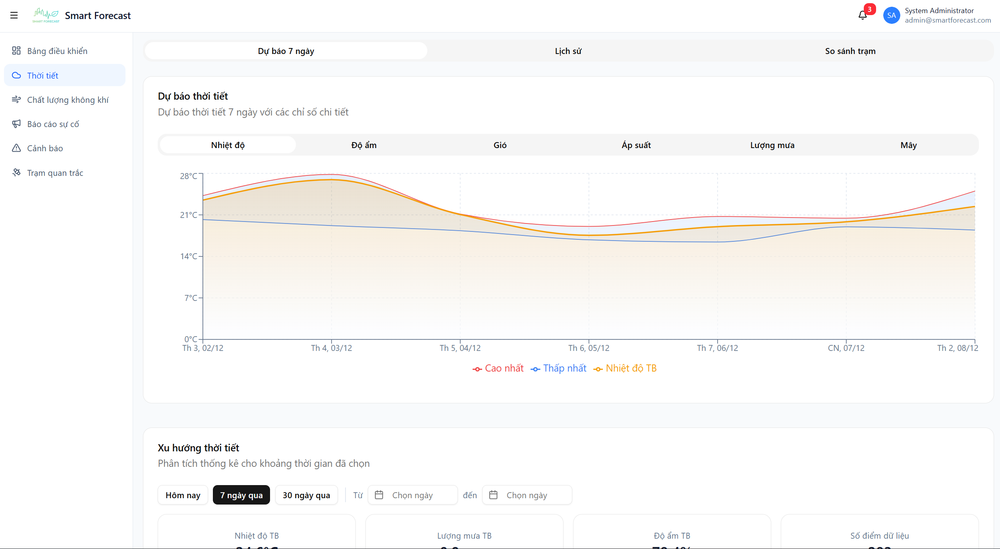
  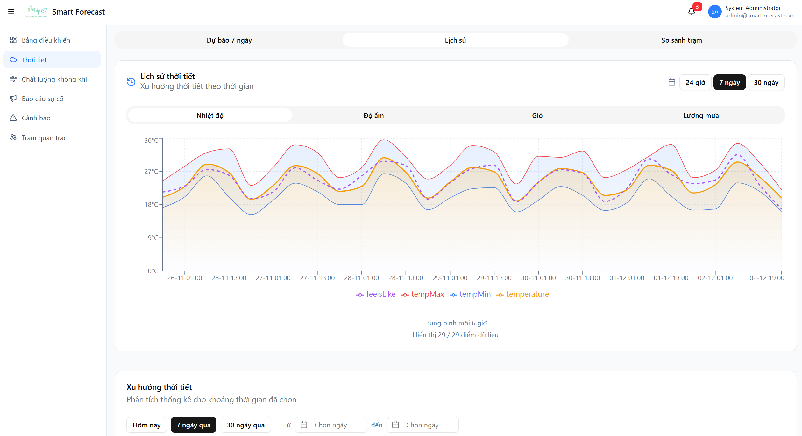
</p>
<p align="center"><em>Biểu đồ dữ liệu môi trường và lịch sử</em></p>

<p align="center">
  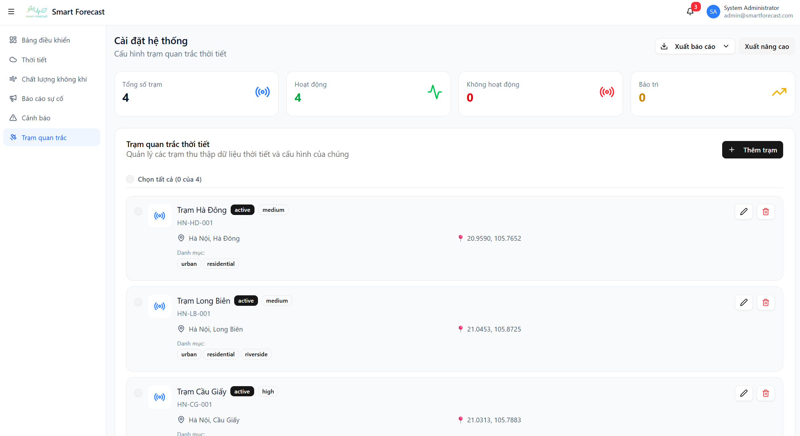
  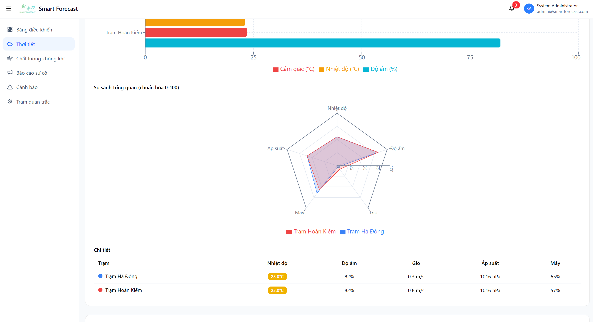
</p>
<p align="center"><em>Danh sách trạm quan trắc và so sánh dữ liệu giữa các trạm</em></p>

### 📱 Mobile App

<p align="center">
  
  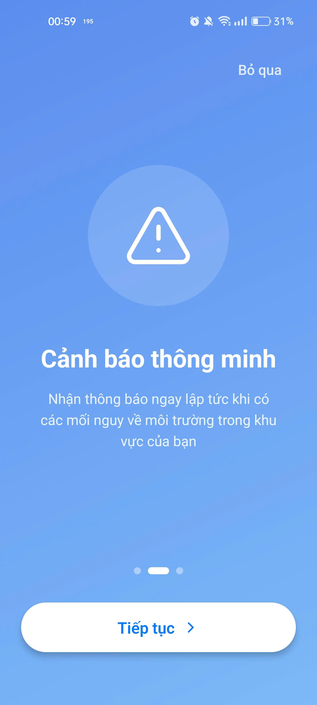
  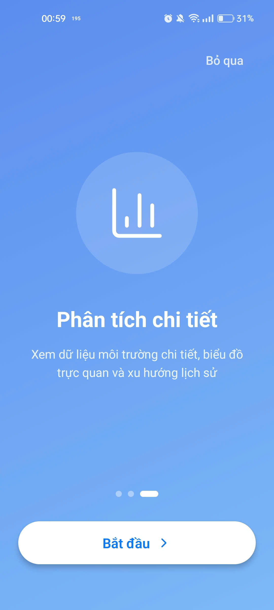
  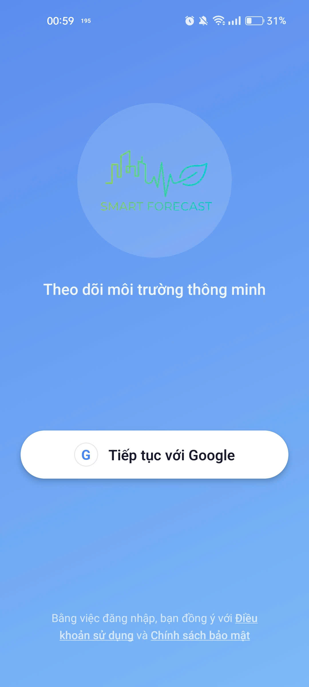
</p>
<p align="center"><em>Màn hình giới thiệu ứng dụng và Đăng nhập Google</em></p>

<p align="center">
  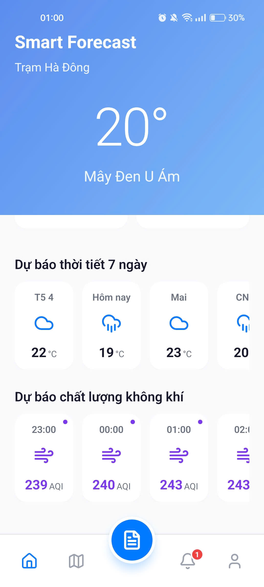
  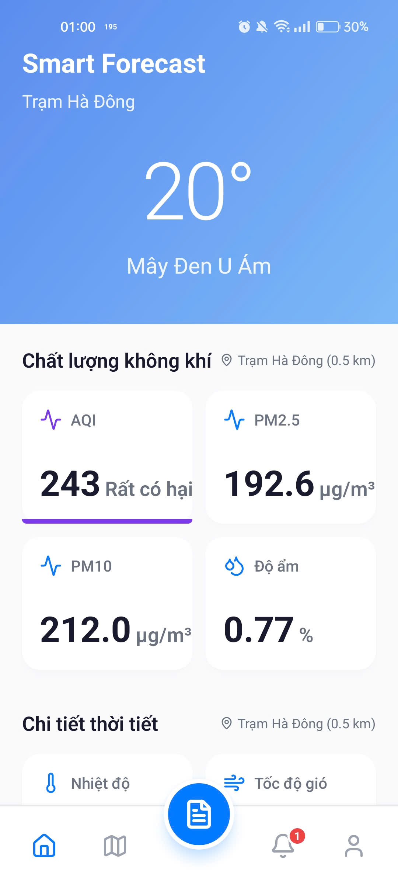
  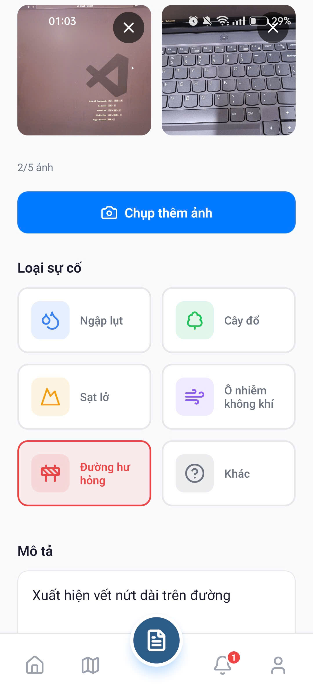
  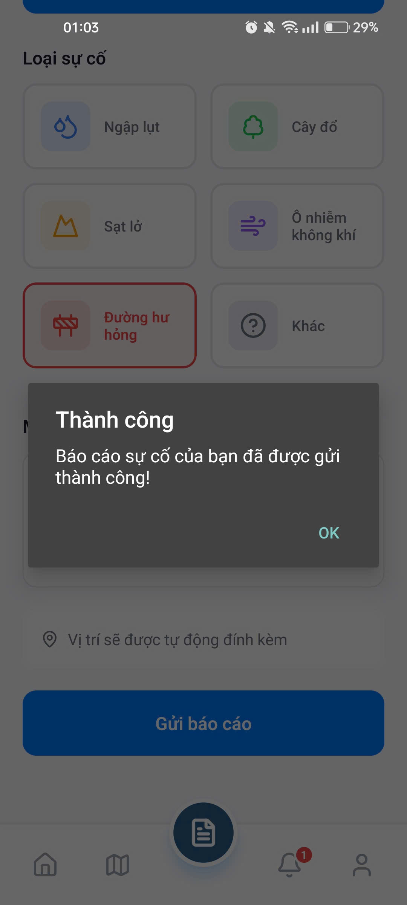
</p>
<p align="center"><em>Màn hình chính và Báo cáo sự cố</em></p>

<p align="center">
  
  
  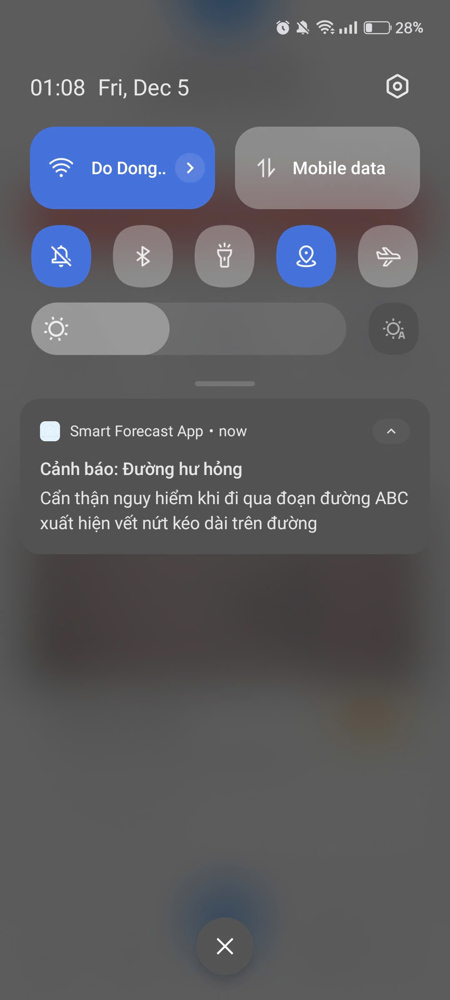
  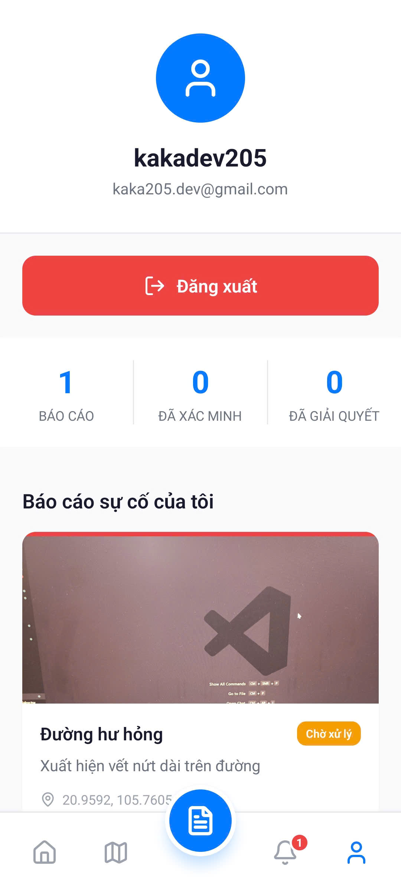
</p>
<p align="center"><em>Bản đồ cảnh báo, Thông báo và Hồ sơ cá nhân</em></p>

### 🎬 Demo Video

<!-- TODO: Thêm link YouTube demo -->

> 🎥 Video demo sẽ được cập nhật sau

---

## 🏗️ Kiến trúc hệ thống

<p align="center">
  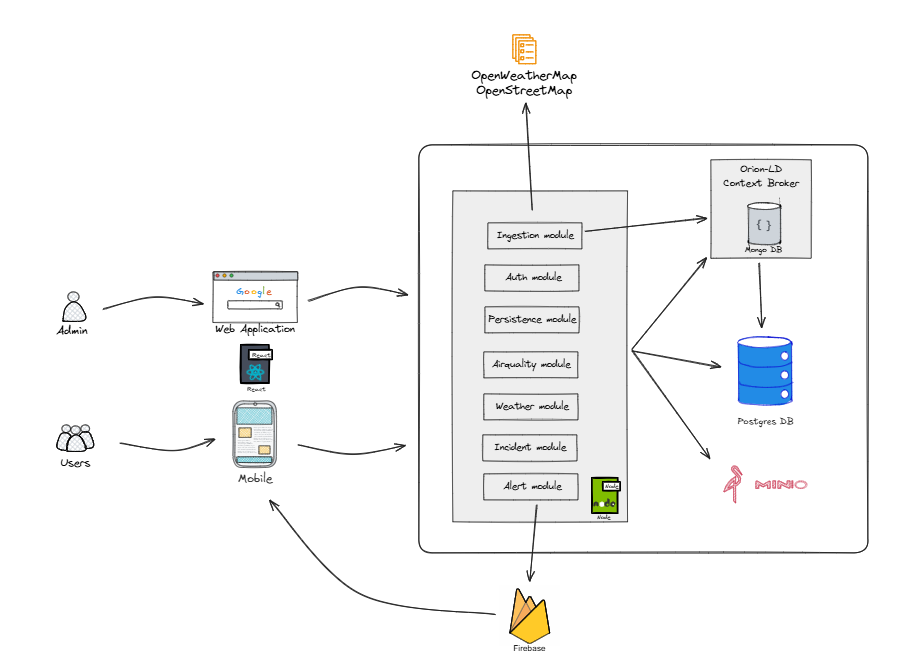
</p>

```
                    ┌─────────────────────────────────────────┐
                    │              DATA SOURCES               │
                    │         (OpenWeatherMap APIs)           │
                    └─────────────────┬───────────────────────┘
                                      │
                                      ▼
┌─────────────────┐     ┌─────────────────────────────────────┐
│   Mobile App    │     │           Backend (NestJS)          │
│   (Expo RN)     │◄───►│  • Data Ingestion (NGSI-LD)         │
└─────────────────┘     │  • Alert Management                 │
                        │  • Incident Reports                 │
┌─────────────────┐     │  • Push Notifications (FCM)         │
│  Web Dashboard  │◄───►│  • REST API                         │
│   (Next.js)     │     └─────────────────┬───────────────────┘
└─────────────────┘                       │
                            ┌─────────────┼─────────────┐
                            │             │             │
                       ┌────▼────┐    ┌───▼────┐    ┌───▼────┐
                       │ Orion   │    │Postgres│    │ MinIO  │
                       │   -LD   │    │   DB   │    │Storage │
                       └────┬────┘    └────────┘    └────────┘
                            │
                       ┌────▼────┐
                       │ MongoDB │
                       └─────────┘
```

### 📦 Cấu trúc Monorepo

```
smart-forecast/
├── backend/        # NestJS API Server
├── web/            # Next.js Admin Dashboard
├── mobile/         # Expo React Native App
├── shared/         # Shared TypeScript Models & Constants
├── docs-site/      # Docusaurus Documentation
├── docker-compose.yml
└── pnpm-workspace.yaml
```

---

## 🛠️ Tech Stack

| Thành phần           | Công nghệ                                                                                                                                                                                                               |
| -------------------- | ----------------------------------------------------------------------------------------------------------------------------------------------------------------------------------------------------------------------- |
| **Backend**          |       |
| **Web Frontend**     |   |
| **Mobile App**       |            |
| **Context Broker**   |  Orion-LD (NGSI-LD)                                                                                                                              |
| **Databases**        |    |
| **Object Storage**   |  (S3-compatible)                                                                                                        |
| **Notifications**    |  Cloud Messaging                                                                                               |
| **Data Source**      | OpenWeatherMap API                                                                                                                                                                                                      |
| **Containerization** |  Docker Compose                                                                                                      |
| **Package Manager**  |  Monorepo Workspace                                                                                                        |

---

## 🚀 Cài đặt nhanh

### Yêu cầu hệ thống

- **Docker** >= 20.10
- **Docker Compose** >= 2.0
- **Node.js** >= 18.x (cho development)
- **pnpm** >= 8.x

### Quick Start (3 bước)

```bash
# 1️⃣ Clone repository
git clone https://github.com/NEU-DataVerse/Smart-Forecast.git
cd Smart-Forecast

# 2️⃣ Copy file môi trường
cp .env.example .env
cp backend/.env.example backend/.env
# Chỉnh sửa các API keys trong backend/.env

# 3️⃣ Khởi động tất cả services
docker compose up -d
```

### Truy cập các dịch vụ

| Dịch vụ           | URL                          | Mô tả                   |
| ----------------- | ---------------------------- | ----------------------- |
| **Backend API**   | http://localhost:8000/api/v1 | REST API & Swagger Docs |
| **Web Dashboard** | http://localhost:3000        | Admin Dashboard         |
| **Orion-LD**      | http://localhost:1026        | Context Broker          |
| **MinIO Console** | http://localhost:9001        | Object Storage UI       |

### Development Mode

```bash
# Cài đặt dependencies
pnpm install

# Build shared package
pnpm run build:shared

# Chạy backend development
pnpm run dev:backend

# Chạy web development
pnpm run dev:web

# Chạy mobile (Expo)
pnpm run dev:mobile
```

> 📖 **Chi tiết hơn?** Xem [QUICKSTART.md](QUICKSTART.md) hoặc [Tài liệu đầy đủ](#-tài-liệu)

---

## 📚 Tài liệu

| Tài liệu                           | Mô tả                   |
| ---------------------------------- | ----------------------- |
| [QUICKSTART.md](QUICKSTART.md)     | Hướng dẫn cài đặt nhanh |
| [CHEATSHEET.md](CHEATSHEET.md)     | Các lệnh thường dùng    |
| [CONTRIBUTING.md](CONTRIBUTING.md) | Hướng dẫn đóng góp      |
| [CHANGELOG.md](CHANGELOG.md)       | Lịch sử thay đổi        |

### Tài liệu chi tiết (Docusaurus)

> 🌐 https://neu-dataverse.github.io/Smart-Forecast/

- Kiến trúc hệ thống (Architecture)
- Hướng dẫn triển khai (Deployment)
- API Documentation
- Data Models (NGSI-LD)
- Hướng dẫn sử dụng

---

## 🤝 Đóng góp

Chúng tôi hoan nghênh mọi đóng góp! Xem [CONTRIBUTING.md](CONTRIBUTING.md) để biết thêm chi tiết.

```bash
# Fork repo → Tạo branch → Commit → Push → Pull Request
git checkout -b feat/amazing-feature
git commit -m "feat: add amazing feature"
git push origin feat/amazing-feature
```

---

## 👥 Team NEU-DataVerse

<table>
  <tr>
    <td align="center">
      <a href="https://github.com/Mkhai205">
        <br />
        <sub><b>Khải (Mkhai205)</b></sub>
      </a><br />
      <sub>PM, Backend, Frondend, DevOps</sub>
    </td>
    <td align="center">
      <a href="https://github.com/NGUYENTHANHDATHH">
        <br />
        <sub><b>Đạt (NGUYENTHANHDATHH)</b></sub>
      </a><br />
      <sub>Frontend</sub>
    </td>
    <td align="center">
      <a href="https://github.com/BichCan">
        <br />
        <sub><b>Bích (BichCan)</b></sub>
      </a><br />
      <sub>Design UI, Docs</sub>
    </td>
  </tr>
</table>

---

## 📄 License

Dự án được phân phối dưới giấy phép **MIT License**. Xem file [LICENSE](LICENSE) để biết thêm chi tiết.

---

<p align="center">
  <strong>Nhóm NEU-DataVerse – OLP'2025</strong><br/>
  <em>🌍 Smart Forecast – Khi dữ liệu mở trở thành cảnh báo sớm cho cộng đồng</em>
</p>
