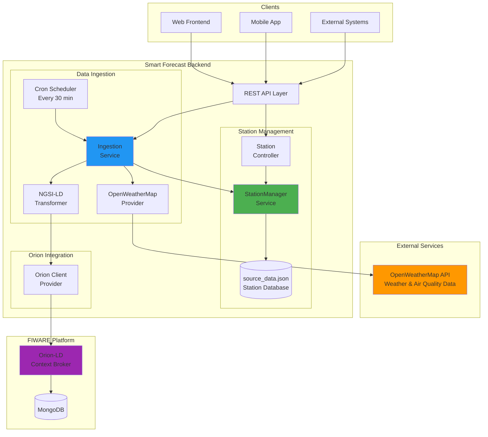
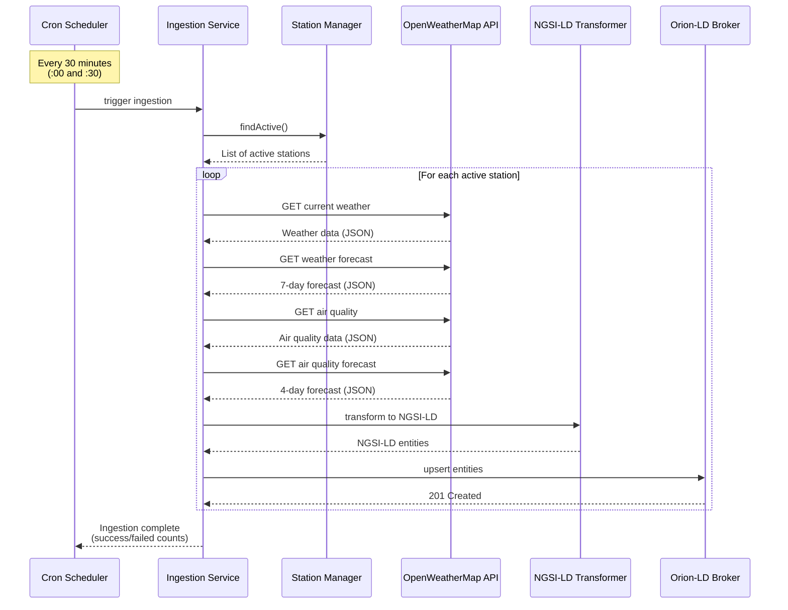
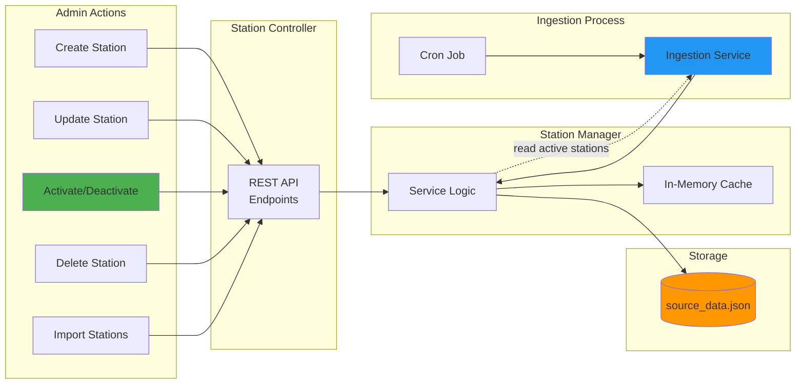
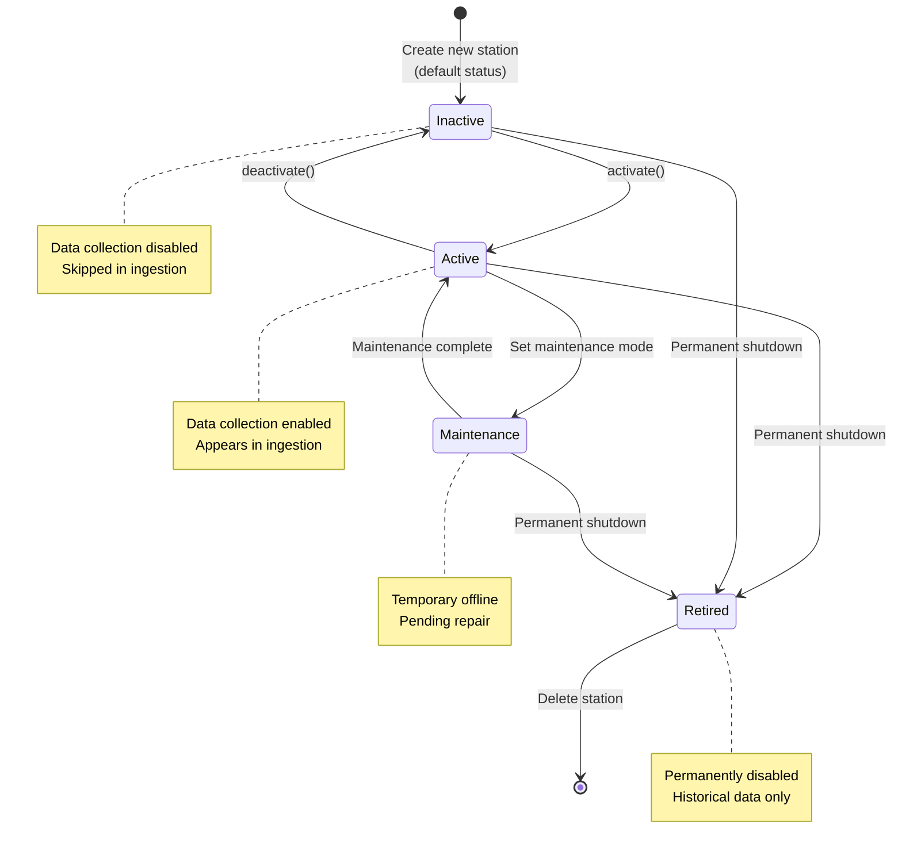
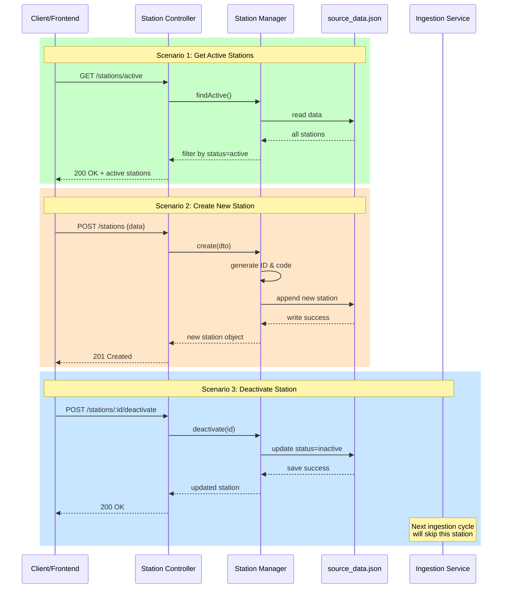
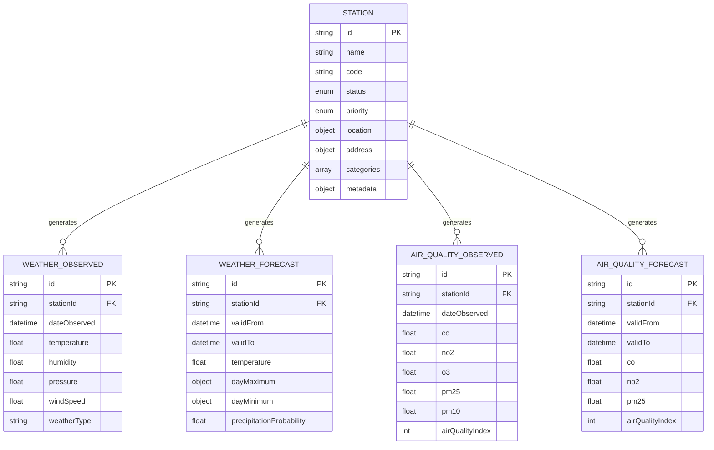
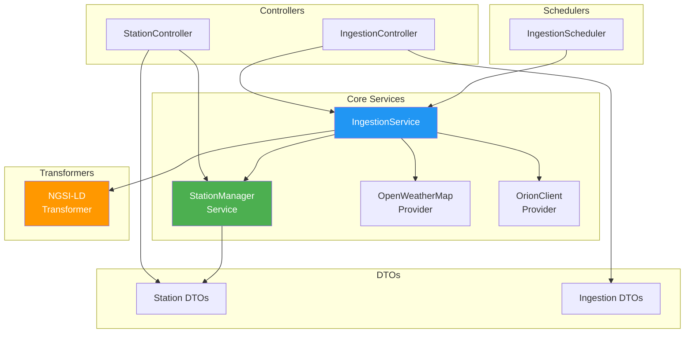
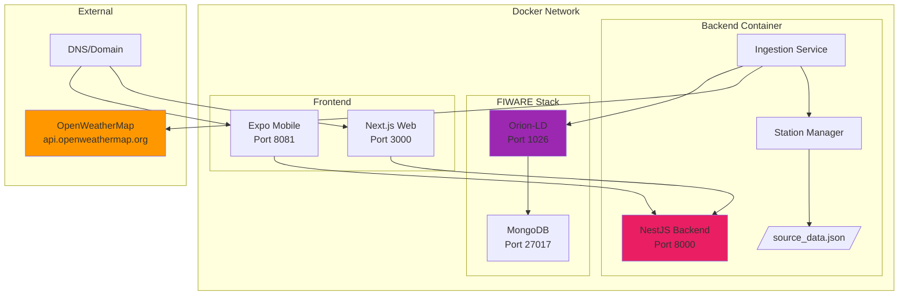
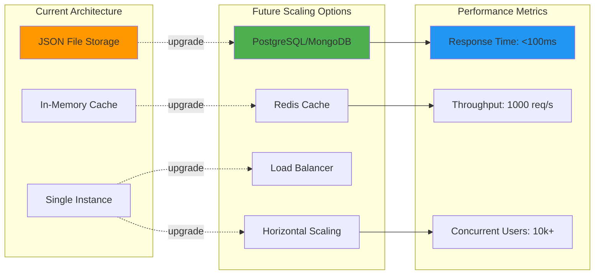
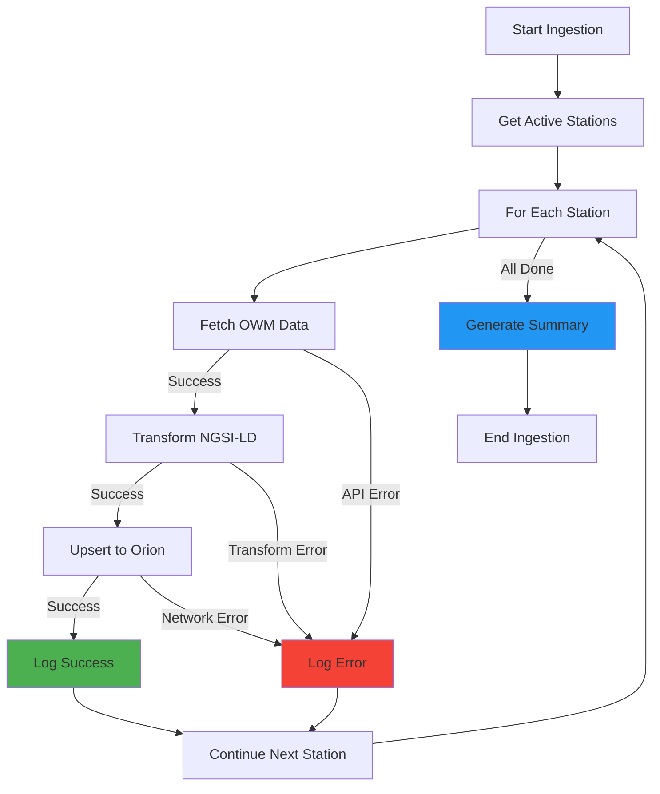

# 📊 Smart Forecast System Architecture Diagrams

## 1. Tổng Quan Hệ Thống (System Overview)



## 2. Luồng Dữ Liệu Thu Thập (Data Collection Flow)



## 3. Station Management Flow (Quản Lý Trạm)



## 4. Station Status Lifecycle (Vòng Đời Trạng Thái)



## 5. API Request Flow (Luồng Xử Lý API)



## 6. Data Model Relationships (Mối Quan Hệ Dữ Liệu)



## 7. Component Dependencies (Phụ Thuộc Giữa Các Thành Phần)



## 8. Deployment Architecture (Kiến Trúc Triển Khai)



## 9. Performance & Scaling (Hiệu Năng & Mở Rộng)



## 10. Error Handling Flow (Xử Lý Lỗi)



## Notes

### Diagram Tools

Các diagram trên sử dụng Mermaid syntax, có thể render trực tiếp trên:

- GitHub README.md
- VS Code với Mermaid extension
- Confluence/Notion/GitLab
- https://mermaid.live/ (online editor)

### Customization

Bạn có thể customize colors, styles bằng cách thêm:

```mermaid
style NodeName fill:#color,stroke:#color,color:#textcolor
```

### Export

Các diagram có thể export sang:

- PNG/SVG (qua mermaid CLI)
- PDF (print từ browser)
- Draw.io format (qua converter)

---

**Version:** 1.0.0  
**Last Updated:** November 21, 2025
